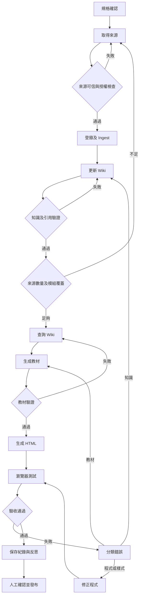

# Workflow Graph V1（規劃，尚未執行完整流程）

```mermaid
flowchart TD
 A[規格確認] --> B[取得來源]
 B --> C{來源可信與授權檢查}
 C -->|失敗| B
 C -->|通過| D[登錄及 Ingest]
 D --> E[更新 Wiki]
 E --> F{知識及引用驗證}
 F -->|失敗| E
 F -->|通過| G{來源數量及模組覆蓋}
 G -->|不足| B
 G -->|足夠| H[查詢 Wiki]
 H --> I[生成教材]
 I --> J{教材驗證}
 J -->|失敗| H
 J -->|通過| K[生成 HTML]
 K --> L[瀏覽器測試]
 L --> M{驗收通過}
 M -->|失敗| N[分類錯誤]
 N -->|知識| E
 N -->|教材| I
 N -->|程式或樣式| O[修正程式]
 O --> L
 M -->|通過| P[保存紀錄與反思]
 P --> Q[人工確認並發布]
```
每錯誤迴圈最多自動重試三次，超限 BLOCKED。各階段均需人工確認才進入下一階段。Graph V2 待真實測試證據。
